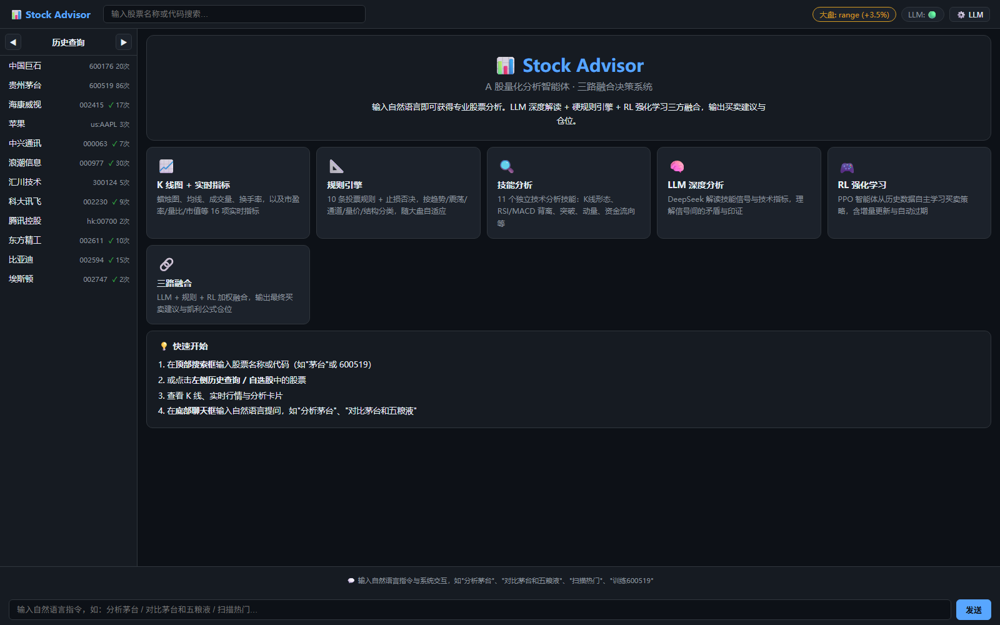
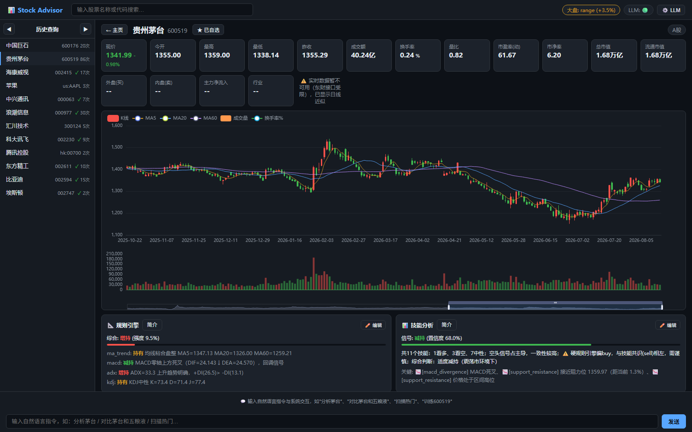

<div align="center">

# 📈 Stock Advisor — A 股量化分析智能体

[](https://www.python.org/downloads/)
[](https://github.com/1oatr/stock-advisor-agent)

基于 **LLM 深度分析 + 硬规则引擎 + RL 强化学习** 三方融合的 A 股智能分析系统。
输入自然语言或股票代码，即可获得综合买卖建议与凯利公式仓位。

</div>

---

## 🖥️ 产品预览

| 主页 | 股票详情页 |
|:---:|:---:|
|  |  |
| 首页展示系统能力与快速入口 | K 线图 + 实时指标卡 + 分析卡片 |

## ✨ 功能特性

| 能力 | 覆盖内容 |
|------|---------|
| 三路融合决策 | LLM 深度推理 / 硬规则引擎 / RL 强化学习三方独立打分，加权融合输出最终建议 |
| Web 可视化仪表盘 | ECharts K 线图、实时行情、5 张分析卡片、对话式查询，前后端一体 |
| 11 个技术分析技能 | K 线形态、RSI/MACD 背离、突破、量价关系、资金流、多周期共振等 |
| 硬规则引擎 | 10 条投票规则 + 止损否决，按类别加权投票，市场自适应调整阈值 |
| 凯利公式仓位 | 基于融合置信度与共识度计算仓位，不打满凯利、熊市自动减仓 |
| LLM 可关闭 | 不设 API Key 自动降级到本地引擎，界面与命令行均可一键关闭 |
| CLI / REPL | 交互式问答、单股分析、多股对比、预测、训练、回测等命令 |
| RL 训练与生命周期 | PPO 单股模型，按训练时间自动增量微调 / 全量重训 / 清理 |

### 技术栈与数据来源

| 用途 | 工具 |
|------|------|
| 数据源 | akshare（新浪 + 东方财富） |
| 数据处理 | pandas / numpy |
| 技术指标 | pandas-ta |
| RL 框架 | gymnasium + stable-baselines3 + PyTorch |
| LLM | DeepSeek（OpenAI 兼容） |
| Web | Flask + 原生 JS + ECharts（本地 vendor） |
| CLI | click / rich |

## 🚀 快速开始

### 方式一：Web 一键启动（推荐）

Windows 下直接双击 `start.bat`：

- 自动检查 Python 环境并安装缺失依赖（首次约需数分钟）
- 自动启动服务并打开浏览器

浏览器访问 **http://127.0.0.1:5000** 即可使用。前端由 Flask 托管，无需单独构建，前后端一体。

> 点击页面头部「⚙️ LLM」按钮可在弹窗中关闭 LLM 开关；关闭后分析与聊天全部走本地逻辑，不依赖任何外部 API。

### 方式二：CLI / 开发者

```bash
# 1. 安装依赖
pip install -r requirements.txt

# 2. 设置 DeepSeek API Key（可选，不设置也能运行，走本地降级引擎）
export DEEPSEEK_API_KEY="sk-你的key"

# 3. 常用命令
python -m src.main                       # 启动交互式 REPL
python -m src.main analyze 600519        # 深度分析单股
python -m src.main predict 600519 000858 # 三路融合预测
python -m src.main compare 600519 000858 # 多股对比
python -m src.main train 600519          # 训练 RL 模型
```

## 📁 项目结构

```
stock-advisor/
├── src/
│   ├── agent/      # Agent 核心（Planner / Executor / Memory / 融合引擎）
│   ├── tools/      # LLM 可调用工具
│   ├── rl/         # RL 单股训练与生命周期管理
│   ├── knowledge/  # 硬规则引擎
│   ├── skills/     # 11 个技术分析技能
│   ├── advisor/    # 决策融合 + 凯利仓位 + 排名
│   ├── data/       # 数据获取 / 指标计算 / 清洗
│   ├── webui/      # Flask Web 仪表盘
│   ├── backtest/   # 回测引擎
│   └── main.py     # CLI 入口
├── config/         # 全局配置
├── models/         # RL 模型存储
└── data/           # 缓存与长期记忆
```

## ⚠️ 免责声明

本项目仅供学习与研究使用，**不构成任何投资建议**。股市有风险，投资需谨慎，据此操作产生的任何盈亏由使用者自行承担。
